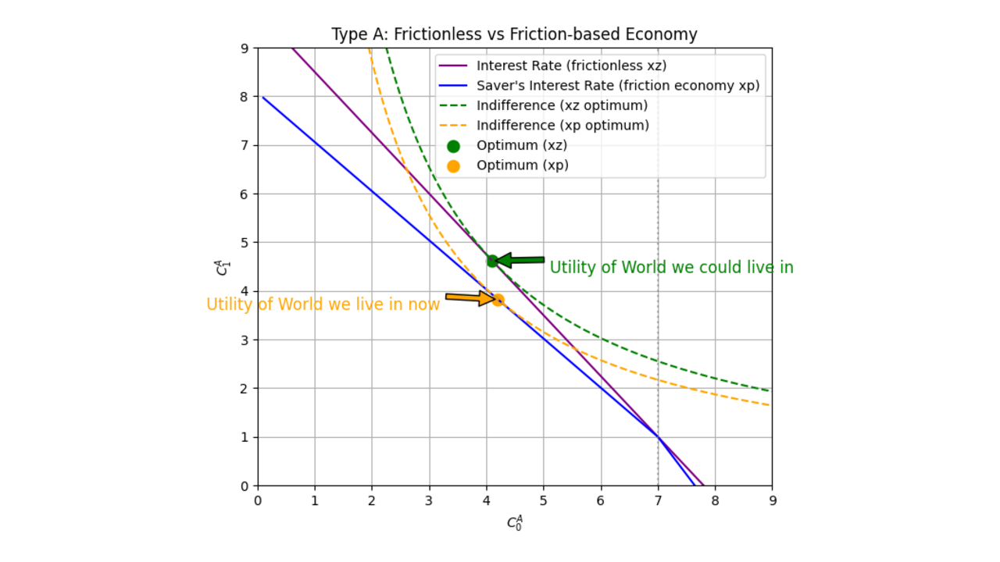

---
## Problem Setup

Consider a two-period economy with two types of households:

$$
\begin{cases}
\text{Type A (fraction $\theta$)}: y_0^A \gg y_1^A \quad \text{(rich today, poor tomorrow)}
\end{cases}
$$

$$
\begin{cases}
\text{Type B (fraction $1-\theta$)}: y_1^B \gg y_0^B \quad \text{(poor today, rich tomorrow)}
\end{cases}
$$

Both maximize discounted log-utility:

$$
U(C_0^i, C_1^i) = \log(C_0^i) + \beta \log(C_1^i), \quad i \in \{A,B\}.
$$

For some further mathematical intuition:

$$
\begin{aligned}
\max_{C_0^i, C_1^i}\ &\log(C_0^i) + \beta \log(C_1^i) \\
\text{s.t.}\ & C_0^i + \frac{1}{1+r_d}C_1^i = y_0^i + \frac{1}{1+r_d}y_1^i
\end{aligned}
$$

Type A households naturally want to *save* (lend), while Type B want to *borrow*.  
If financial markets were frictionless, a single equilibrium interest rate would perfectly match the supply of savings with the demand for borrowing.

---

## The Reality: A Positive Spread

In practice, financial intermediaries impose a wedge between borrowing and lending rates:

$$
r_l > r_d, \qquad (1+r_l) = (1+r_d)(1+x), \qquad x \approx r_l - r_d.
$$

The spread $x$ captures the *inefficiency of intermediation*:

- Savers (Type A) earn the low deposit rate $r_d$.  
- Borrowers (Type B) pay the high loan rate $r_l$.  

---

## Individual Optimization

### Type A (savers)

Optimal consumption solves:

$$
C_0^A = \frac{y_0^A + \tfrac{1}{1+r_d}y_1^A}{1+\beta}, \qquad
C_1^A = \beta(1+r_d)C_0^A.
$$

Type A saves positively: $S_0^A = y_0^A - C_0^A > 0$.

### Type B (borrowers)

Optimal consumption solves:

$$
C_0^B = \frac{y_0^B + \tfrac{1}{1+r_l}y_1^B}{1+\beta}, \qquad
C_1^B = \beta(1+r_l)C_0^B.
$$

Type B borrows at $t=0$: $S_0^B = y_0^B - C_0^B < 0$.

---

## Market-Clearing and Equilibrium Rates

Deriving bond market clearing delivers equilibrium deposit and loan rates:

$$
\mathcal{D}^{bond} = \int_{0}^{\theta} S_0^A \, di = \theta \left( y_0^A -   \frac{y_0^A + \tfrac{1}{1+r_d}y_1^A}{1+\beta}\right)
$$

$$
\mathcal{S}^{bond} = \int_{\theta}^{1} S_0^A \, di = (1-\theta) \left( y_0^B -  \frac{y_0^B + \tfrac{1}{1+r_l}y_1^B}{1+\beta}\right)
$$

Letting $\mathcal{S}^{bond} = \mathcal{D}^{bond}$ and solving for $r_l$ and $r_d$, we obtain the optimal rates of lending and borrowing, denoted with a $*$ superscript:

$$
r_d^* = \frac{\theta y_1^A + \tfrac{1-\theta}{1+x} y_1^B}{\beta(\theta y_0^A + (1-\theta) y_0^B)} - 1,
$$

$$
r_l^* = \frac{(1+x)\theta y_1^A + (1-\theta) y_1^B}{\beta(\theta y_0^A + (1-\theta) y_0^B)} - 1.
$$

In the *ideal* case ($x=0$), these rates coincide.  
In reality ($x>0$), they diverge.

---

## Aggregate Utility Comparison between a Zero Interest Rate Gap Economy and an Interest Rate Gap Economy

The utility of the economy at large can be written as:

$$
\begin{aligned}
U_{aggregate} &= \int_0^1 U(C_0^i, C_1^i)\, di \\
&= \theta \left[\log(C_0^A) + \beta \log(C_1^A)\right] + (1-\theta)\left[\log(C_0^B) + \beta \log(C_1^B)\right]
\end{aligned}
$$

Let **xp** denote a positive interest rate difference ($r_l - r_d > 0$) and **xz** denote a zero interest rate gap ($r_l - r_d = 0$).  

Since $r_{d,xp}^* < r_{xp} < r_{l,xp}^*$, we can plug these back into our optimal conditions and compare the values of optimal utility:

$$
U_{A, xp} < U_{A,xz}, \quad U_{B,xp} < U_{B, xz}.
$$

---

## Graphical Interpretation



The blue and purple lines represent budget constraints as defined in the problem setup.  
The blue line is a piecewise function that has a slope of $\frac{1}{1+r_d}$ up until the point $(y_0, y_1) = (7,1)$.  
Beyond that point, the slope changes to $\frac{1}{1+r_l}$.  
The green and orange lines are indifference curves representing utility.


Similarly, the blue and purple lines represent budget constraints.  
The blue line has a slope of $\frac{1}{1+r_d}$ up to $(y_0, y_1) = (2,7)$, after which it changes to $\frac{1}{1+r_l}$.  
The green and orange lines represent indifference curves.

---

## Economic Interpretation

In the ideal frictionless economy, the interest rate is unique, and savings and borrowing are efficiently allocated.  
In the real economy, intermediaries create a spread to pay for tellers, branches, credit analysts, etc.  
Savers earn less, borrowers pay more, and society as a whole is worse off.

**Moral:**  
We don’t live in the “ideal world” where credit flows at a single fair rate.  
Instead, intermediation costs show up as a wedge between $r_d$ and $r_l$, lowering utility for everyone who is borrowing or lending money.


<!--  -->


<!-- 
Author 1, Author 2. Year. "Title." *Journal* Volume (Issue): First page–Last page. https://doi.org/paper_doi.

```BibTeX
@article{AAYY,
author = {Author 1 and Author 2},
doi = {paper_doi},
journal = {Journal},
number = {Issue},
pages = {XXX--YYY},
title = {Title},
volume = {Volume},
year = {Year}}
``` -->
